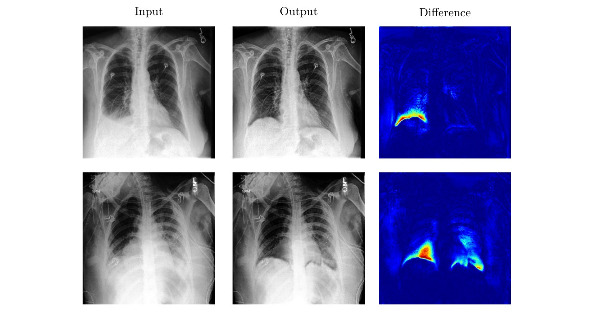

# DeScarGAN: Disease-Specific Anomaly Detection with Weak Supervision
This is the official Pytorch implementation of the paper DeScarGAN: Disease-Specific Anomaly Detection with Weak Supervision by Julia Wolleb, Robin Sandkühler and Philippe C. Cattin.


Paper Abstract
-------------------
Anomaly detection and localization in medical images is a challenging task, especially when the anomaly exhibits a change of existing structures, e.g., brain atrophy or changes in the pleural space due to pleural effusions. In this work, we present a  weakly supervised and detail-preserving method that is able to detect structural changes of existing anatomical structures. In contrast to standard anomaly detection methods, our method extracts information about the disease characteristics from two groups: a group of patients affected by the same disease and a healthy control group. Together with identity-preserving mechanisms, this enables our method to extract highly disease-specific characteristics for a more detailed detection of structural changes. We designed a specific synthetic data set to evaluate and compare our method against state-of-the-art anomaly detection methods. Finally, we show the performance of our method on chest X-ray images. Our method called DeScarGAN outperforms other anomaly detection methods on the synthetic data set and by visual inspection on the chest X-ray image data set.




Datasets
-------------------
For the generation of the synthetic dataset, one has to run the  script “create_synthetic_dataset”. A new folder called "warp-set" will be created and the generated images of both the diseased and healthy subjects will be stored in there seperately.

If one wants to use the Chexpert dataset, it is available for download on this page: https://stanfordmlgroup.github.io/competitions/chexpert/.
The data needs to be structured as follows:


    • Train
        ◦ Healthy control
        ◦ Images showing pleural effusion
    • Validate
        ◦ Healthy control
        ◦ Images showing pleural effusion
    • Test
        ◦ Healthy control
        ◦ Images showing pleural effusion
        

Training & Testing
-------------------

For the script “main.py”, there are the following options:

`--dataset`:   One has to determine which dataset has to be used (either “Chexpert” or “Synthetic”). 

`--dataset-path`:  The path to the data folders.

`--mode`:  One can choose between the mode “train” or “test”. When training, the networks are saved in the folder “./save_nets”. During test-time, the saved models are loaded. Plots showing the convergence of the loss functions and results are visualized using visdom (see https://github.com/facebookresearch/visdom for documentation).

Citation
--------------------
If you use this code, please cite 
```
@misc{wolleb2020descargan,
    title={DeScarGAN: Disease-Specific Anomaly Detection with Weak Supervision},
    author={Julia Wolleb and Robin Sandkühler and Philippe C. Cattin},
    year={2020},
    eprint={2007.14118},
    archivePrefix={arXiv},
    primaryClass={eess.IV}}
```
